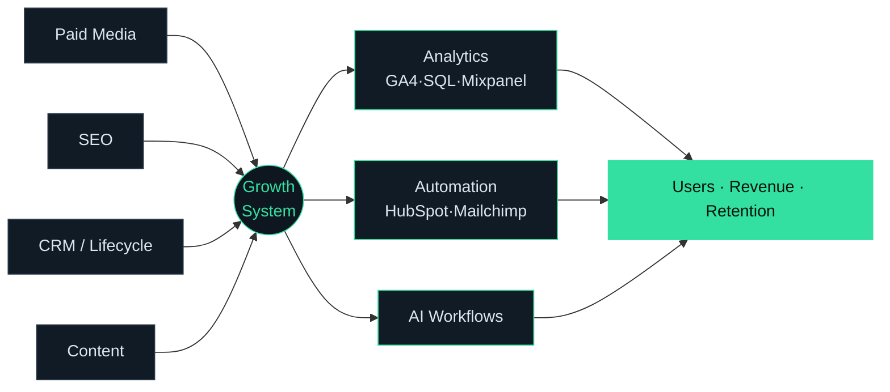

  

  <b>I architect marketing, analytics, automation & AI into systems that compound.</b> 
  1.42M users · $220K ad spend · 6–18× ROAS · churn 27% → 7%

  <a href="https://linkedin.com/in/danny-ai-marketing">LinkedIn</a> ·
  <a href="https://dannygrowthmarketing.com">Website</a> ·
  <a href="mailto:danieldeepak3519@gmail.com">Email</a>

---

### The system I build

---

### Results — each tied to where it happened

| Result | Engagement |
|---|---|
| 1.42M+ users scaled (1.32M new) | EveryWatch |
| 150K+ leads on $220K ad spend · 6–18× ROAS | EveryWatch |
| CPA −33% ($1.20 → $0.80) | EveryWatch |
| Churn 27% → 7% via lifecycle automation | EveryWatch |
| +230% monthly conversions (900 → 3,000) | ClearSpot.ai |
| 26.9M impressions · 475K+ clicks · 173K+ conversions | TONI&GUY |

---

### Case studies — receipts, not bullet points

<b>🏆 EveryWatch — a growth engine from near-zero to 1.42M users</b>

**Context** — Global luxury watch marketplace, every channel at ground zero.
**Built** — Multi-channel acquisition (Google, Meta, LinkedIn, YouTube, SEO) + a from-scratch attribution stack (GA4, GTM, Mixpanel, PostgreSQL) + full lifecycle automation.
**Results** — 1.42M users · 150K leads on $220K spend · CPA −33% · 6–18× ROAS · churn 27% → 7% · 1.6M+ monthly organic impressions.
➡️ [Full case study](https://github.com/dannygrowthmarketing/everywatch-growth-case-study)

<b>📈 Marketing Analytics in SQL — the data layer behind the decisions</b>

Runnable SQL on a realistic dataset: cohort retention, CPA/ROAS by channel, funnel drop-off, CAC/LTV.
➡️ [Explore the queries](https://github.com/dannygrowthmarketing/marketing-analytics-sql)

<b>🔁 Lifecycle Automation Playbook — taking churn from 27% to 7%</b>

Journey maps, trigger logic, win-back sequences, and an AI-assisted segmentation workflow.
➡️ [See the playbook](https://github.com/dannygrowthmarketing/lifecycle-automation-playbook)

---

### Built with
`Google Ads` · `Meta Ads` · `LinkedIn Ads` · `GA4` · `GTM` · `Mixpanel` · `Looker Studio` · `SQL` · `Power BI` · `HubSpot` · `Mailchimp` · `Ahrefs` · `Technical SEO` · `CRO` · `AI Workflows`

### Open to
Roles where I own the **whole growth system** — remote (USA · UK · Europe · Australia).
Searchable: Senior Performance Marketing Manager · Growth Marketing Manager · Marketing Analytics Manager · Demand Generation Manager · Revenue Operations

### Connect
🌐 [dannygrowthmarketing.com](https://dannygrowthmarketing.com) · 💼 [LinkedIn](https://linkedin.com/in/danny-ai-marketing) · 📧 danieldeepak3519@gmail.com
