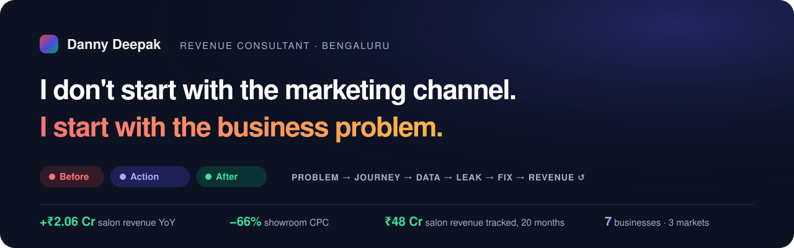

### Independent revenue consultant · AI-assisted · Bengaluru

I don't start with the marketing channel. I start with the business problem: **customer → journey → data → leak → diagnosis → fix → revenue → retention → measurement**.
I trace your customer from first search to the till and back for the second visit, find the step where money stops, fix it in order, and report bills, bookings and orders. Not clicks.

| You are | What you get from me |
| :-- | :-- |
| Paying for leads that don't turn into sales | The step where they drop, and the fix, in that order |
| Seeing "great ROAS" but flat revenue | A reconciliation of platform claims vs your till |
| Winning first visits but not repeat ones | A remarketing + retention loop with a number on it |

### What I build and run

| | |
| :-- | :-- |
| **Websites** | Shopify, Netlify, fast landing and service pages, SEO and site health |
| **Apps** | Android booking app (Jetpack Compose), iOS in build |
| **Booking + payments** | Booking flows with a payment gateway, prepaid vs COD |
| **CRM** | HubSpot, Google Sheets + Apps Script CRM, sales CRM dashboards, lead routing |
| **Google Business Profile** | Multi-location profiles, services, categories, review dashboards |
| **Paid media** | Google Search, PMax, Shopping, Demand Gen, Meta lead and WhatsApp ads |
| **Retention + automation** | Remarketing, WhatsApp and email flows, n8n workflows, call tracking (Exotel) |
| **Measurement** | GA4, GTM, Looker Studio, ad platforms reconciled to the till and CRM |

**[→ Open the Revenue Casebook](https://dannygrowthmarketing.github.io/revenue-casebook/)** · [Free 12-point leak check](https://dannygrowthmarketing.github.io/revenue-casebook/check.html) · [LinkedIn](https://linkedin.com/in/danny-ai-marketing) · danieldeepak3519@gmail.com

---

### Case studies: what I built, what it moved

<table>
<tr>
<td width="50%" valign="top"> <b>TONI&GUY Bangalore</b> · 16 salons <b>+1.3% → +14.7%</b> growth on last year, before vs after I joined. Website, Android app, booking CRM, 51 campaigns, 16 profiles</td>
<td width="50%" valign="top"> <b>MR Jewels</b> · jewellery D2C Google claimed 11.8× the company's revenue; reconciled to Shopify. Showroom CPC <b>₹38.60 → ₹13.13</b></td>
</tr>
<tr>
<td valign="top"> <b>Gold Coins Club & Resort</b> · active 5,621 enquiries joined in one dashboard. Found conversion <b>24% → 14%</b>, Q2 to Q3. 45 Business Profile changes</td>
<td valign="top"> <b>Elites Dental Care</b> · active 4.9★ · 271 reviews. Profile and Search rebuilt; website, booking + payment, patient CRM in build</td>
</tr>
<tr>
<td valign="top"> <b>Foremost Public Adjusters</b> · Florida 24 pages rewritten, 19 site fixes, all-services campaign at <b>$48</b> per lead (3 leads)</td>
<td valign="top"> <b>EveryWatch</b> · marketplace <b>20×</b> monthly new users; organic impressions <b>0.10M → 5.5M</b> a month</td>
</tr>
</table>

Also: [Swift Restoration](https://dannygrowthmarketing.github.io/revenue-casebook/swift-restoration.html) (Iowa, diagnostic) · [Leak library](https://dannygrowthmarketing.github.io/revenue-casebook/leaks.html)

### Full client reports

| Client | Reports |
| :-- | :-- |
| TONI&GUY Bangalore | [Final](https://dannygrowthmarketing.github.io/toniguy-final-report/) · [August](https://dannygrowthmarketing.github.io/toniguy-august-2026-report/) · [July](https://dannygrowthmarketing.github.io/toniguy-july-2026-report/) · [June](https://dannygrowthmarketing.github.io/toniguy-june-2026-report/) |
| MR Jewels | [Seven weeks](https://dannygrowthmarketing.github.io/mrjewels-seven-weeks/) · [August](https://dannygrowthmarketing.github.io/mrjewels-august-2026-report/) · [All-time account review](https://dannygrowthmarketing.github.io/mrjewels-google-ads-case-study/) |
| Elites Dental Care | [Growth report](https://dannygrowthmarketing.github.io/elites-dental-growth-report/Elites-Dental-Care-Growth-Report_2.html) |
| Foremost Public Adjusters | [Growth report](https://dannygrowthmarketing.github.io/foremost-pa-growth-case-study/) · [Brand audit](https://dannygrowthmarketing.github.io/foremost-pa-growth-case-study/Foremost_GoogleAds_Brand_Visibility_Audit.html) |
| Swift Restoration | [Case study](https://github.com/dannygrowthmarketing/swift-restoration-growth-marketing-case-study) |

### How every number is labelled

`Measured` · `Calculated` · `Estimated` · `Assumption` · `Data not available`. Where the chain from ad spend to revenue breaks, the casebook says so instead of quoting a ROAS. Up to two years of each client's data.

### Tools

Google Ads · Meta Ads · SEO & local SEO · GBP · Shopify · Netlify · Android (Jetpack Compose) · payment gateways · HubSpot · Google Sheets + Apps Script CRM · n8n · Exotel · GA4 · GTM · Looker Studio · AI workflows (Claude)
Certified: Google Ads Search · Google Analytics 4 · HubSpot · Meta Blueprint
